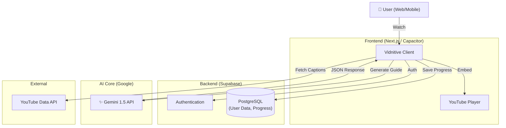

# Vidnitive (My Language Dojo) 🥋

<p align="center">
  
</p>

<p align="center">
  <b>「動画を見ていたら、いつの間にか学んでいた」</b><br>
  AI-Powered Immersive Language Learning Platform
</p>

<p align="center">
  
</p>

---

## 📖 概要 (Overview)

**Vidnitive** は、YouTube上のあらゆる動画を「語学教材」に変換する学習プラットフォームです。
Google Gemini APIを活用し、動画の字幕データから「単語リスト」「文法解説」「理解度クイズ」をリアルタイムで生成。
ユーザーは興味のある動画（エンタメ、ニュース、Vlogなど）を見るだけで、パーソナライズされた学習が可能になります。

## 💡 開発背景 (Background)

私は**個別指導塾の講師**として働く中で、「既存の教材がつまらなく、生徒の学習継続率が低い」という課題に直面しました。
また、**USJ（ユニバーサル・スタジオ・ジャパン）でのクルー経験**から、「没入感（Immersion）」こそが人の行動を変える鍵だと学びました。
これらを掛け合わせ、「生徒が好きな動画で、遊びのように学べるツール」を作るために開発しました。

## ✨ 主な機能 (Key Features)

### 1. 📺 Video Learning
* **概要:** YouTube動画のデュアル字幕表示、インタラクティブなトランスクリプト同期。
* **特徴:** クリックするだけでその時点から再生、単語の意味を即座に検索。

### 2. 🤖 AI Study Guides
* **概要:** 動画の内容理解を深めるための学習ガイドを自動生成。
* **技術:** `Gemini 1.5 Flash` を活用し、文脈に沿った「重要語彙」「文法ポイント」「要約クイズ」をリアルタイムに出力。System InstructionによるJSONスキーマ制御で高精度を実現。

### 3. 🎮 Gamification
* **概要:** XP（経験値）システム、レベルアップ機能による学習継続の動機付け。
* **記録:** 学習履歴をヒートマップで可視化し、日々の積み重ねを実感。

### 4. 🎙️ Voice Recorder
* **概要:** シャドーイング練習のためのブラウザ録音機能。
* **技術:** Web Audio APIを活用し、自分の発音を録音・再生して比較可能。

---

## 🛠 技術スタック (Tech Stack)

| Category | Technology | Usage |
| :--- | :--- | :--- |
| **Frontend** | **Next.js 15** (App Router) | SSR/RSC, Static Export for Mobile |
| **Language** | **TypeScript** | Strict Type Safety |
| **Styling** | **Tailwind CSS** | Shadcn UI, Responsive Design |
| **Backend** | **Supabase** | Auth, Database (PostgreSQL), Edge Functions |
| **AI Model** | **Google Gemini 1.5** | Flash (Real-time), Pro (High Reasoning) |
| **Mobile** | **Capacitor** | iOS/Android Native Wrappers |
| **Admin Tool** | **Ruby on Rails 8** | 管理者用ダッシュボード (KPI分析) |
| **Deployment** | **Vercel** | Web Hosting & Edge Network |

---

## 🏗️ アーキテクチャ (Architecture)



## こだわった点・技術的選定 (Technical Highlights)

### 1. 開発スピードと品質の両立 (Development Strategy)
本プロジェクトは個人開発でありながら、商用レベルのUI/UXを目指しました。
そのため、認証(Auth)や決済基盤の構築にはSaaSボイラープレート（**Antigravity**）を採用し、**「車輪の再発明」を徹底的に排除しました。**
浮いた時間の9割を、コア機能である「AIによる学習体験の向上（プロンプトエンジニアリング、UIのレスポンス）」に投資しています。

### 2. AIレスポンスの最適化 (AI Engineering)
Gemini APIからの出力を安定させるため、System Instructionで厳格なJSONスキーマを定義。
ハルシネーション（嘘の出力）を抑制し、学習教材としての精度を担保するプロンプト設計に注力しました。

---

## Getting Started

### Prerequisites

* Node.js 18+
* npm or yarn

### Installation

1. Clone the repository:
   ```bash
   git clone https://github.com/naki0227/my-language-dojo.git
   cd my-language-dojo
   ```

2. Install dependencies:
   ```bash
   npm install
   ```

3. Set up environment variables:
   Create a `.env.local` file in the root directory.
   ```env
   NEXT_PUBLIC_SUPABASE_URL=your_supabase_url
   NEXT_PUBLIC_SUPABASE_ANON_KEY=your_supabase_anon_key
   SUPABASE_SERVICE_ROLE_KEY=your_service_role_key
   GOOGLE_GEMINI_KEY=your_gemini_api_key
   ```

4. Run the development server:
   ```bash
   npm run dev
   ```

## License

MIT
