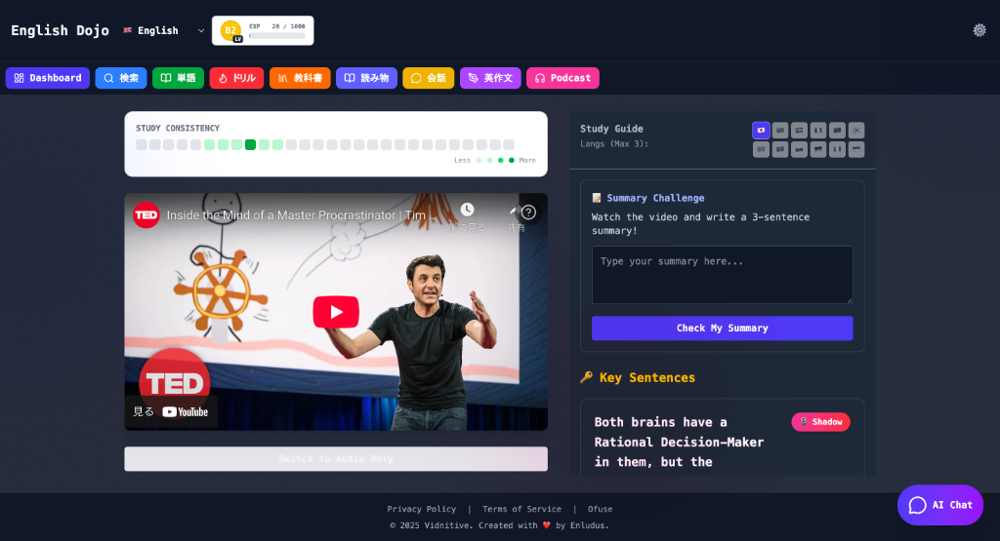
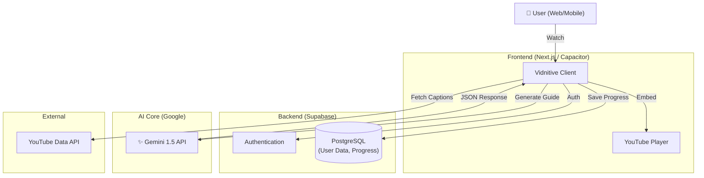

# Vidnitive (My Language Dojo) 🥋

<p align="center">
  
</p>

<p align="center">
  <b>"Learn before you know it, just by watching."</b><br>
  AI-Powered Immersive Language Learning Platform
</p>

<p align="center">
  
</p>

---

[🇯🇵 Japanese (日本語)](README.ja.md)

## 📖 Overview

**Vidnitive** is a learning platform that transforms any YouTube video into "Language Learning Material".
Leveraging the Google Gemini API, it generates "Vocabulary Lists", "Grammar Explanations", and "Comprehension Quizzes" in real-time from the video's subtitle data.
Users can enjoy personalized learning simply by watching videos they are interested in (Entertainment, News, Vlogs, etc.).

## 💡 Background

While working as a **tutor in a private cram school**, I faced the issue that "existing materials were boring and student retention rates were low."
Also, from my **crew experience at USJ (Universal Studios Japan)**, I learned that "Immersion" is the key to changing human behavior.
Combining these, I developed this tool to create an environment where "students can learn like playing with their favorite videos".

## ✨ Key Features

### 1. 📺 Video Learning
*   **Overview:** Dual subtitle display for YouTube videos, interactive transcript synchronization.
*   **Feature:** Click to play from that point, instantly look up word meanings.

### 2. 🤖 AI Study Guides
*   **Overview:** Automatically generates study guides to deepen understanding of video content.
*   **Technology:** Uses `Gemini 1.5 Flash` to output context-aware "Key Vocabulary", "Grammar Points", and "Summary Quizzes" in real-time. High precision achieved via JSON schema control in System Instructions.

### 3. 🎮 Gamification
*   **Overview:** XP (Experience Points) system and leveling up to motivate continuous learning.
*   **Record:** Visualize learning history with heatmaps to feel daily progress.

### 4. 🎙️ Voice Recorder
*   **Overview:** Browser recording function for shadowing practice.
*   **Technology:** Uses Web Audio API to record and playback your pronunciation for comparison.

---

## 🛠 Tech Stack

| Category | Technology | Usage |
| :--- | :--- | :--- |
| **Frontend** | **Next.js 15** (App Router) | SSR/RSC, Static Export for Mobile |
| **Language** | **TypeScript** | Strict Type Safety |
| **Styling** | **Tailwind CSS** | Shadcn UI, Responsive Design |
| **Backend** | **Supabase** | Auth, Database (PostgreSQL), Edge Functions |
| **AI Model** | **Google Gemini 1.5** | Flash (Real-time), Pro (High Reasoning) |
| **Mobile** | **Capacitor** | iOS/Android Native Wrappers |
| **Admin Tool** | **Ruby on Rails 8** | Admin Dashboard (KPI Analysis) |
| **Deployment** | **Vercel** | Web Hosting & Edge Network |

---

## 🏗️ Architecture



## Technical Highlights

### 1. Development Strategy
Although this is a personal project, I aimed for a commercial-level UI/UX.
Therefore, I adopted a SaaS boilerplate (**Antigravity**) for building authentication and payment infrastructure, thoroughly eliminating **"reinventing the wheel"**.
90% of the saved time was invested in core functions, "improving the learning experience with AI (Prompt Engineering, UI Response)".

### 2. AI Engineering
To stabilize the output from the Gemini API, I defined a strict JSON schema in the System Instruction.
I focused on prompt design to suppress hallucinations and ensure accuracy as learning material.

---

## Getting Started

### Prerequisites

* Node.js 18+
* npm or yarn

### Installation

1. Clone the repository:
   ```bash
   git clone https://github.com/naki0227/my-language-dojo.git
   cd my-language-dojo
   ```

2. Install dependencies:
   ```bash
   npm install
   ```

3. Set up environment variables:
   Create a `.env.local` file in the root directory.
   ```bash
   NEXT_PUBLIC_SUPABASE_URL=your_supabase_url
   NEXT_PUBLIC_SUPABASE_ANON_KEY=your_supabase_anon_key
   SUPABASE_SERVICE_ROLE_KEY=your_service_role_key
   GOOGLE_GEMINI_KEY=your_gemini_api_key
   ```

4. Run the development server:
   ```bash
   npm run dev
   ```

## License

MIT
